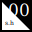

# status.health® External Brand Guide



## Table of Contents

1. [About status.health](#about-statushealth)
2. [Brand Identity](#brand-identity)
3. [Visual Guidelines](#visual-guidelines)
4. [Voice & Messaging](#voice--messaging)
5. [Technical Positioning](#technical-positioning)
6. [Usage Guidelines](#usage-guidelines)
7. [Contact Information](#contact-information)

## About status.health

status.health® is enterprise health verification infrastructure that enables businesses to verify health information without storing protected health information (PHI). Through zero-knowledge proof technology and on-device processing, we eliminate HIPAA liability while providing cryptographic verification of health facts.

### Mission
Enable businesses to verify health information at scale without creating regulatory liability or privacy risk.

### Core Technology
- **Zero-Knowledge Proofs**: Mathematical verification without data exposure
- **On-Device Processing**: All sensitive operations occur on user hardware
- **No PHI Storage**: Never create, receive, maintain, or transmit protected health information
- **Patent-Pending**: [US Patent Application 19/200,691](https://drive.google.com/file/d/1_4DmuODdSGVrdFsH3eMu758Moij-I_vp/view)

### Target Markets
- Identity verification platforms
- Insurance carriers
- Dating platforms  
- Clinical research organizations
- Employers and HR tech
- Healthcare staffing agencies

## Brand Identity

### Primary Identity

| Element | Specification |
|---------|--------------|
| **Name** | status.health® (always lowercase) |
| **Corporate Entity** | Health Protocol Labs, SPC |
| **Logo** | "s.h/00" s.h for status.health and 00 representing zero data, zero risk |
| **Primary Tagline** | Zero data. Zero risk. |
| **Secondary Tagline** | HIPAA compliant through zero PHI storage |

*All logos can be found in [./assets](./assets/)*

### Logo Meaning
The "00" logo represents our core value proposition:
- First zero: Zero data stored
- Second zero: Zero risk of breach
- Together: Mathematical certainty through zero-knowledge architecture

*Curious? Manifesto’s [this way](https://status.health/manifesto).*

## Visual Guidelines

### Logo System

#### Primary Logo
- **Mark**: "00" in Georgia serif font
- **Wordmark**: "status.health" in Verdana
- **Usage**: Never separate the mark from wordmark in primary applications
- **Minimum Size**: 40px height for digital, 0.5 inches for print

#### Logo Files
- `logo-dark.svg`: For light backgrounds
- `logo-light.svg`: For dark backgrounds
- Always use SVG for digital applications when possible

### Color Palette

#### Primary Colors
```
Black:  #000000 (primary text, dark mode background)
White:  #FFFFFF (primary background, dark mode text)
```

#### Secondary Colors
```
Link Blue:     #0000EE (classic web standard)
Visited Link:  #551A8B (web standard purple)
Muted Gray:    #666666 (secondary text)
Border Gray:   #CCCCCC (dividers, borders)
```

#### Accent Colors (Limited Use)
Rainbow gradient for special applications only:
```css
background: linear-gradient(135deg,
  rgba(255, 200, 200, 0.8),  /* Pastel Pink */
  rgba(255, 230, 200, 0.8),  /* Pastel Orange */
  rgba(255, 255, 200, 0.8),  /* Pastel Yellow */
  rgba(200, 255, 200, 0.8),  /* Pastel Green */
  rgba(200, 230, 255, 0.8),  /* Pastel Blue */
  rgba(220, 200, 255, 0.8),  /* Pastel Purple */
  rgba(255, 200, 230, 0.8)   /* Pastel Pink */
);
```

### Typography

#### Logo Typography
- **Mark**: Georgia (serif)
- **Wordmark**: Verdana (sans-serif)

#### Digital Typography
- **Headings**: Verdana (bold)
- **Body Text**: Georgia (serif)
- **Technical/Code**: System monospace

#### Hierarchy
- **H1**: 24px Verdana bold
- **H2**: 20px Verdana bold  
- **H3**: 18px Verdana bold
- **Body**: 15px Georgia
- **Small**: 14px Georgia

## Voice & Messaging

### Brand Voice Characteristics

#### Direct & Concise
- No marketing fluff
- Get to the point quickly
- Technical accuracy over clever copy
- One idea per paragraph

#### Technical Yet Accessible
- Explain complex concepts simply
- Assume enterprise technical knowledge
- Focus on implementation details
- Avoid unnecessary jargon

#### Privacy-Obsessed
- User control is paramount
- Mathematical guarantees, not promises
- Transparency in all operations
- Zero-trust architecture

### Core Messaging Framework

#### Primary Value Propositions
1. **Zero Data = Zero Risk**: Can't leak what you don't store
2. **HIPAA Compliant by Design**: Architecture eliminates liability
3. **User-Controlled Verification**: Privacy through user device processing
4. **Enterprise-Ready**: Built for scale, security, and compliance

#### Messaging Pillars

**For Identity Verification Platforms:**
"Add health facts to your KYC flow without HIPAA liability"

**For Insurance Carriers:**
"Verify wellness milestones without storing health data"

**For Dating Platforms:**
"Enable health verification badges with zero liability"

**For Clinical Research:**
"Confirm protocol compliance without PHI exposure"

### Writing Guidelines

#### Do:
- Use "we" and "you" for conversational tone
- Lead with business value
- Include technical proof points
- Keep paragraphs to 3-4 sentences
- Use active voice

#### Don't:
- Make health claims
- Store or reference actual health data
- Use consumer-oriented language
- Include emotional appeals
- Explain basic privacy concepts

## Technical Positioning

### Architecture Overview
status.health® implements health verification through three core methods:

1. **On-Device OCR**: Machine vision processes documents locally
2. **Direct API Integration**: OAuth connections to health platforms
3. **Local AI Processing**: Document extraction on user hardware

### Key Differentiators
- First enterprise-grade zero-knowledge health verification
- 98% lower operational costs than traditional verification
- No Business Associate Agreement required
- Patent-pending verification methodology
- Closed-source with contractual code review option

### Compliance Positioning
- **HIPAA**: Not a covered entity or business associate
- **GDPR**: Not a data processor or controller for health data
- **SOC 2**: Simplified compliance through zero-data architecture
- **State Laws**: No health data residency requirements

## Usage Guidelines

### Trademark Usage

#### Correct Usage
- status.health® (with ® in formal contexts)
- status.health (acceptable in running text)
- Always lowercase

#### Incorrect Usage
- ~~Status.Health~~ (incorrect capitalization)
- ~~statushealth~~ (missing dot)
- ~~status health~~ (missing dot)
- ~~Status Health, Inc.~~ (wrong entity name)

### Brand Application Rules

1. **Logo Integrity**
   - Never modify or recreate the logo
   - Maintain minimum clear space (½ logo height)
   - Don't rotate, skew, or add effects
   - Use provided files only

2. **Color Usage**
   - Primary applications use black/white only
   - Rainbow gradient reserved for special accents
   - Maintain WCAG AA contrast standards
   - Support both light and dark modes

3. **Typography Standards**
   - Don't substitute fonts
   - Maintain hierarchy relationships
   - Use system fonts for body text when Georgia unavailable
   - Preserve line height ratios

### Legal Requirements

All materials must include appropriate notices:

**Copyright**: © 2025 Status Health SPC. All rights reserved.

**Patent**: Patent pending (USPTO 19/200,691)

**Trademark**: status.health® is a registered trademark

**For Marketing Materials**: Include "HIPAA compliant through zero PHI storage"

### Prohibited Uses
- Creating derivative works
- Implying medical advice or diagnosis
- Storing or displaying actual health data
- Misrepresenting technical capabilities
- Using brand to imply endorsement

## Contact Information

### Business Inquiries
**Email**: info@status.health  
**Website**: https://status.health

### Partnership & Integration
**Email**: partnerships@status.health  
**Developer Docs**: https://status.health/developers

### Media & Press
**Email**: press@status.health  
**Brand Assets**: Available upon request

---

© 2025 Health Protocol Labs, SPC. All rights reserved. Patent pending.  
status.health® is a registered trademark.